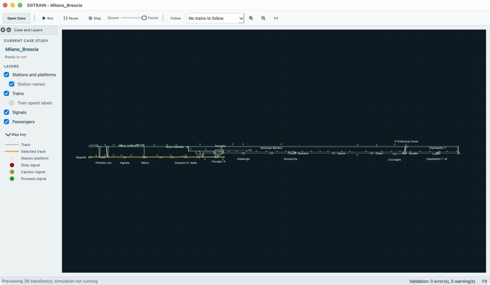
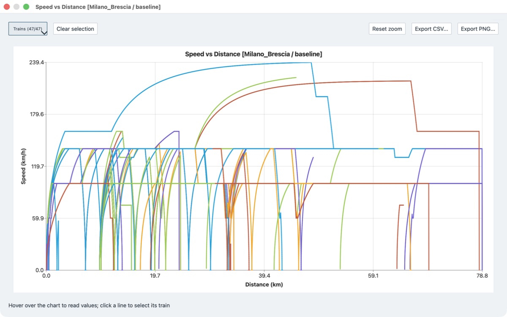

# EGTRAIN





EGTRAIN is a desktop application for microscopic railway simulation. It
combines railway infrastructure, signalling, rolling stock, services,
timetables, and passenger demand in an interactive Qt interface.

The screenshots show the Milano to Brescia corridor before a run and its
speed-versus-distance results after the baseline simulation completes.

## Start here

### Download and run existing scenes

Download a platform package and one or more `.egscene` case studies from the
[EGTRAIN releases page](https://github.com/Ancientkingg/EGTRAIN/releases).
Unpack the application for your platform, launch `QEGTRAIN`, then choose
**File > Open Case Study...** and **Run Scene**. The release page provides
macOS, Windows, and Linux application packages plus the six canonical scenes.

For a source checkout, launch without arguments to open the Netherlands scene,
or use `-n 1` through `-n 6` to select another included case study. See
[Opening an `.egscene` case study](docs/guides/opening-a-case-study.md) for the
downloaded-bundle workflow.

### Create or edit scenes

Use **File > Open Scene Folder...** for an editable canonical V1 scene
directory, or **File > Open Case Study...** for an `.egscene` bundle. Save a
new bundle with **File > Save Case Study As...**. V1 directories remain the
editable source of truth; V2 bundles package the same JSON for transport.

Legacy input is a compatibility boundary, not the normal runtime path. Use
**File > Load Legacy Case...** or `scene_tool import` to create a canonical
scene, and use `scene_tool export` only when an external legacy tool needs
interoperability files. The importer does not modify its source.

- [Using EGTRAIN and authoring V1 scenes](docs/guides/scenes-and-application.md)
- [Opening an `.egscene` case study](docs/guides/opening-a-case-study.md)
- [V1 scene property reference](docs/guides/v1-scene-properties.md)

### Develop or contribute

Start with the [build and test guide](docs/development/build-and-test.md),
then read the [scene model architecture](docs/architecture/scene-model.md)
before changing scene loading, conversion, simulation setup, or persistence.

## What EGTRAIN does

- Loads railway networks and service data from the included case studies.
- Displays tracks, stations, signals, routes, and moving trains in a graphical
  scene.
- Lets users inspect and edit trains, services, timetables, and scene
  properties.
- Simulates train movement over signalled infrastructure, including delays and
  passenger operations.
- Produces timetable, train-path, delay, speed, trajectory, and blocking-time
  results.
- Exports simulation data for reports and external analysis.
- Retains compatibility with existing EGTRAIN input data while scene-based
  editing replaces manual text-file work.

## Background

EGTRAIN was originally developed by
[Egidio Quaglietta](https://orcid.org/0000-0002-7936-5832) as a microscopic
railway simulation model. The model and its early applications are described
in [Quaglietta's doctoral thesis](https://doi.org/10.6092/unina/fedoa/8599).

This repository continues that work as a desktop application for students and
researchers. The original EGTRAIN case-study inputs for the SORTEDMOBILITY
research project are available from
[4TU.ResearchData](https://doi.org/10.4121/e78d0dc2-3123-4510-a2c5-7ad017a02e33.v1).

## Included case studies

EGTRAIN includes six canonical railway scenes:

- Netherlands
- Paimpol, France
- Copenhagen, Denmark
- Milan to Brescia, Italy
- Assignment Gvc-Gdg-Ut
- Lebanon teaching baseline

Select them with the `-n` command-line option:

- `-n 1`: Netherlands
- `-n 2`: Paimpol
- `-n 3`: Copenhagen
- `-n 4`: Milan to Brescia
- `-n 5`: Assignment Gvc-Gdg-Ut
- `-n 6`: Lebanon

## Build from source

Requirements:

- CMake 3.16 or newer
- C++17 compiler
- Qt 5 Core, Gui, Widgets, Charts, and Svg
- OpenMP runtime
- ZeroMQ, cppzmq, and nlohmann-json

Configure and build from the repository root:

```bash
cmake -S . -B build -DEGTRAIN_BUILD_TESTS=ON
cmake --build build
```

On macOS with Homebrew Qt 5, install the dependencies if they are not already
available:

```bash
brew install qt@5 libomp zeromq cppzmq nlohmann-json
cmake -S . -B build -DEGTRAIN_BUILD_TESTS=ON -DCMAKE_PREFIX_PATH=/opt/homebrew/opt/qt@5
cmake --build build
```

## Run a local build

Run the application from `EGTRAIN/QEGTRAIN` so relative scene paths resolve.
After a successful build, use the executable for your platform:

```text
# macOS
../../build/QEGTRAIN.app/Contents/MacOS/QEGTRAIN

# Windows PowerShell, multi-config generator
..\..\build\Release\QEGTRAIN.exe

# Linux
../../build/QEGTRAIN
```

A single-config Windows build may place the executable at
`..\..\build\QEGTRAIN.exe` instead. These are local build paths, not a claim
that a package has been installed.

Useful options include:

```text
-n 3 -h 8000 -g 1 -pax 0 -TSM 0 -RC 0
--scene path/to/case.egscene
--interactive
```

By default, runtime output is written to
`<Qt AppDataLocation>/Output/<scene>`, not necessarily to a repository
directory. Set `QEGTRAIN_OUTPUT_DIR` to choose the base directory; EGTRAIN
then writes `<that-directory>/Output/<scene>`:

```bash
QEGTRAIN_OUTPUT_DIR=/tmp/egtrain-run ../../build/QEGTRAIN --scene path/to/scene
```

## Test

Run these commands from the repository root:

```bash
ctest --test-dir build --output-on-failure
tools/e2e/headless_smoke.py
tools/e2e/visual_polish_smoke.sh
```

The smoke tests cover all six scenes and check application startup, train
movement, trajectory samples, served-station output, and the graphical
interface. See the [build and test guide](docs/development/build-and-test.md)
for focused labels, round-trip checks, CI branch roles, and failure artifacts.

## Documentation

- [Scene schema reference](docs/architecture/scene-schema.md)
- [Scene bundle format](docs/architecture/scene-bundle.md)
- [Release testing checklist](docs/development/release-testing-checklist.md)
- [Assignment corridor](docs/product/assignment-corridor.md)
- [Assignment workflow](docs/product/assignment-workflow.md)

## Repository layout

```text
EGTRAIN/QEGTRAIN/        C++ Qt application source
EGTRAIN/QEGTRAIN/Scenes/ Canonical included case-study data
EGTRAIN/QEGTRAIN/tests/  C++ regression tests
tools/e2e/               End-to-end smoke tests
tools/golden_master/     Output comparison helpers
docs/                    User, architecture, and development documentation
```
