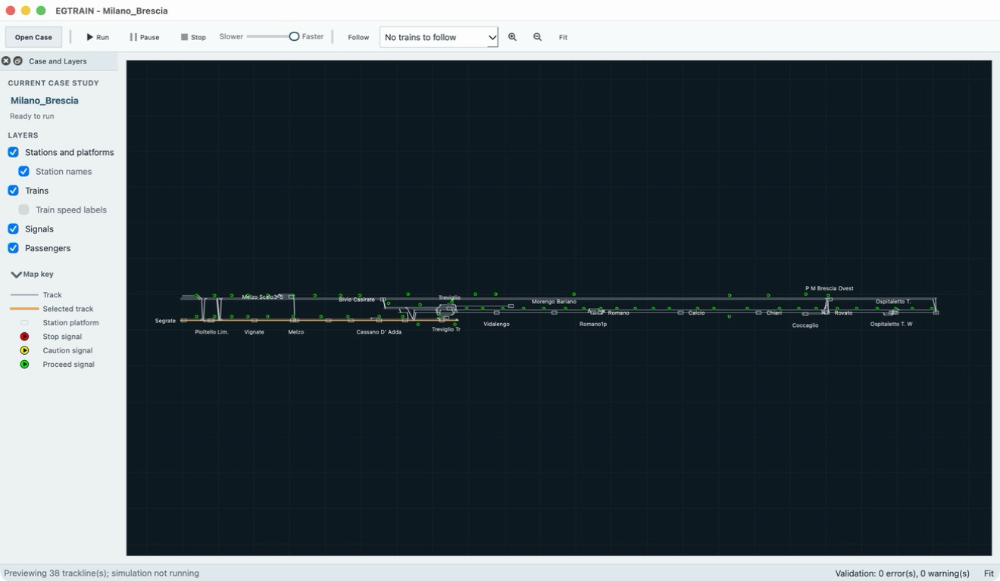
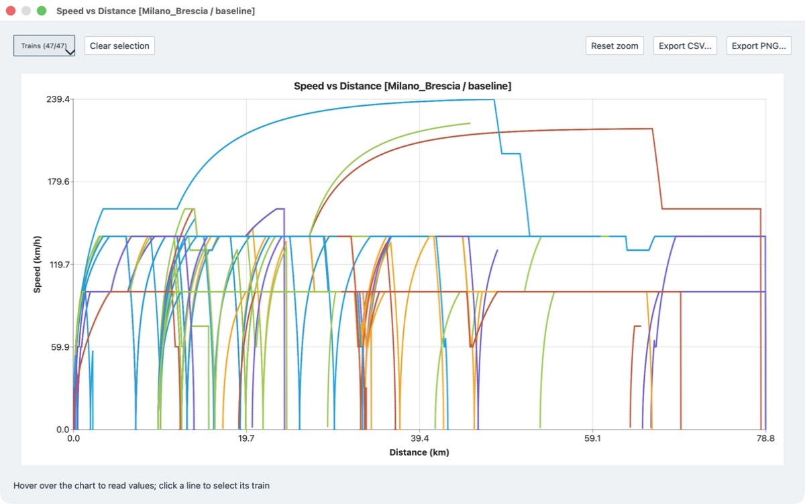

# EGTRAIN

EGTRAIN is a desktop application for microscopic railway simulation. It covers railway networks, signalling, rolling stock, services, timetables, train movement, passenger operations and results in an interactive Qt interface.

[Download](https://github.com/Ancientkingg/EGTRAIN/releases) | [Getting started](#quick-start) | [Documentation](docs/README.md) | [Report an issue](https://github.com/Ancientkingg/EGTRAIN/issues)

The loaded network of Milano_Brescia in the main window before a run.

## Quick start

1. Download the package for your system from the [releases page](https://github.com/Ancientkingg/EGTRAIN/releases): `QEGTRAIN-macos-arm64.zip` (Apple silicon Macs), `QEGTRAIN-windows-x64.zip` (64-bit Windows) or `QEGTRAIN-linux-x86_64.AppImage` (64-bit Linux). Download a case study file from the same page too, such as `Paimpol.egscene`.
2. Start the application.
   - macOS: unzip the package and open `QEGTRAIN.app` from the extracted folder.
   - Windows: unzip the package into a new folder and run `QEGTRAIN.exe` from it. Keep the folder intact. The Windows package is not code signed, so Windows may warn before it starts the program; [Code signing](docs/development/code-signing.md) explains the state and how to check a download.
   - Linux: make the AppImage executable and run it.
3. The application first shows the **Open a Case** window over the case that is already loaded; choose a case in it or continue with the loaded case, and answer any first-start question. Then open the case study with **File > Open Case Study...** and select the downloaded file.
4. Run it with **Simulation > Run** (or **Run** on the toolbar) and confirm the **Run simulation** window.
5. When the run ends, open the **Diagrams** menu for the results, for example **Speed / Distance (per train)...**. The result windows have **Export CSV...** and **Export PNG...**.

[Opening an `.egscene` case study](docs/guides/opening-a-case-study.md) has the details. [Command-line options and scene_tool](docs/guides/command-line.md) covers headless runs, options and the output folder.

## What you can do

- Infrastructure and signalling: view tracks, stations, signals and routes in a graphical scene, and give sections a signalling level with signalling areas.
- Rolling stock, services and timetables: inspect and edit trains, services and timetables.
- Simulation: simulate train movement over signalled infrastructure, including delays and passenger operations.
- Scene editing and validation: edit scenes, validate them before a run, and import legacy cases.
- Results and exports: review timetable, train-path, delay, speed, trajectory and blocking-time results, and export them as CSV and PNG files.

The Speed vs Distance result window of Milano_Brescia (baseline, 47 trains) after a run.

## Case studies

| Case study | Release file | Tracks | Stations | Services | Note |
| --- | --- | ---: | ---: | ---: | --- |
| Netherlands | `Netherlands.egscene` | 268 | 41 | 8 | |
| Paimpol | `Paimpol.egscene` | 6 | 10 | 2 | Paimpol, France. Includes passenger data. |
| Copenhagen | `Copenhagen.egscene` | 168 | 94 | 24 | Copenhagen, Denmark. |
| Milano_Brescia | `Milano_Brescia.egscene` | 38 | 29 | 62 | Milan to Brescia, Italy. |
| Assignment Gvc-Gdg-Ut | `Assignment_Gvc_Gdg_Ut.egscene` | 2 | 3 | 4 | Synthetic two-track fixture, not a distributable TU Delft case. |
| Lebanon | `Lebanon.egscene` | 8 | 34 | 1 | Teaching baseline; the train parameters are not Lebanon rolling-stock data. |
| Amsterdam_Hilversum_Student | `Amsterdam_Hilversum_Student.egscene` | 268 | 41 | 1 | Fictional teaching timetable on the Netherlands network, added after release v1.0.2. See the [student case guide](docs/guides/amsterdam-hilversum-student-case.md). |

The counts are the numbers of entries in `infrastructure.json` (tracks), `stations.json` (stations) and `services.json` (services), so they can differ from the number of trains in a result window. The scene folders are in `EGTRAIN/QEGTRAIN/Scenes` in the repository and inside the application packages.

## Credits and research background

EGTRAIN was originally developed by Prof. [Egidio Quaglietta](https://orcid.org/0000-0002-7936-5832) as a microscopic railway simulation model. Its foundations and early applications are described in his [doctoral thesis](https://doi.org/10.6092/unina/fedoa/8599).

[Samuel Bruin](https://samuelbruin.com/) ([GitHub profile](https://github.com/Ancientkingg)) continues development and maintenance of the desktop application in this repository.

The original EGTRAIN case-study inputs for the SORTEDMOBILITY research project are available from [4TU.ResearchData](https://doi.org/10.4121/e78d0dc2-3123-4510-a2c5-7ad017a02e33.v1).

## Documentation and development

- Run a case study: [Opening an `.egscene` case study](docs/guides/opening-a-case-study.md) and [Command-line options and scene_tool](docs/guides/command-line.md).
- Create or edit scenes: [Using EGTRAIN and authoring V1 scenes](docs/guides/scenes-and-application.md) and [V1 scene properties](docs/guides/v1-scene-properties.md).
- Build, test and contribute: [Build And Test](docs/development/build-and-test.md), [Coding guidelines](docs/development/coding-guidelines.md), [V1 Scene Model](docs/architecture/scene-model.md) and, for the repository layout, [QEGTRAIN source layout](docs/architecture/source-layout.md#repository-layout).

EGTRAIN is a C++17 application built with Qt 5 and CMake. See [Documentation](docs/README.md) for the full list.

## Support

Report problems in [GitHub Issues](https://github.com/Ancientkingg/EGTRAIN/issues). Please include the application version, your operating system, the steps to reproduce the problem, and what you expected against what happened.

Do not upload private project data, such as case study files, logs or screenshots with data you do not want to share, unless it is needed to explain the problem. Remove what you do not want to share.

## License

EGTRAIN's source code is licensed under the
[GNU General Public License, version 3 only](LICENSE)
(`GPL-3.0-only`).

Third-party components retain their own licenses. The code license does not
cover case-study datasets or grant rights to third-party assets; their
respective terms and permissions apply.
