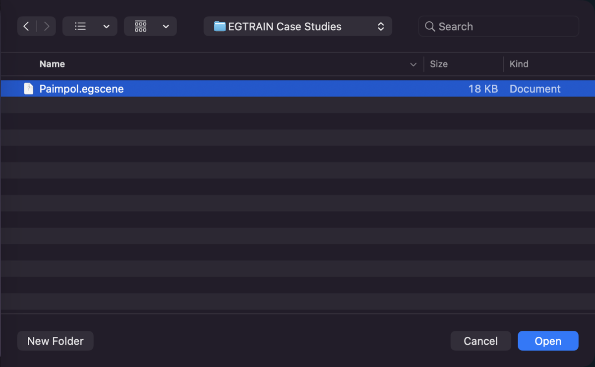
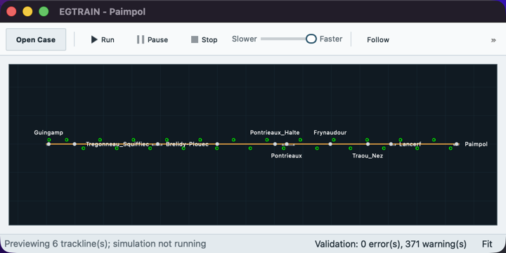

# Opening an `.egscene` case study

An `.egscene` file contains one canonical case study. It is a ZIP archive with
the same JSON data that EGTRAIN loads from a V1 scene directory.

## Open and run

1. Download the case-study `.egscene` file from the
   [EGTRAIN releases page](https://github.com/Ancientkingg/EGTRAIN/releases).
2. In EGTRAIN, choose **File > Open Case Study...** and select the file.

   

3. Review any validation diagnostics shown by the application. The loaded
   network appears in the main window before the simulation starts.

   

4. Choose **Run** when the case study is ready.

Opening a bundle does not run it or modify the downloaded file. Use
**File > Save Case Study As...** to create a new `.egscene` after editing the scene.

EGTRAIN checks the version of a scene before it loads it, and it never changes
the file you opened. Three dialogs report a scene that does not open:

- **Older Scene Not Supported**: the scene reports a version older than any
  EGTRAIN can read. No older version can be upgraded today. Download the
  current case study from the releases page.
- **Newer Scene**: the scene was saved with a newer EGTRAIN. Choose
  **Check for Updates...** to look for the newer release.
- **Cannot Open Scene**: the version cannot be read, or loading the scene
  reports errors. The message names the first problem; keep it.

Scenes saved before 2026-08-08 use an older layout under the same version
number and are not supported; use the current case studies, or convert the
original legacy input folder again with **File > Load Legacy Case...**.

See the [Compatibility boundary](../architecture/scene-model.md#compatibility-boundary)
for the full list of which scenes open.

If EGTRAIN rejects a downloaded file, keep the diagnostic message and download
the file again. The reader rejects truncated archives, unknown files, unsafe
paths, duplicate entries, and files that exceed the documented bundle limits.

## Instructor and command-line use

Directory scenes remain the editable source format. The command-line tool can
pack, inspect, and unpack them:

```bash
scene_tool pack path/to/scene case-study.egscene
scene_tool validate case-study.egscene
scene_tool unpack case-study.egscene path/to/unpacked-scene
```

The unpack destination must be a new path; the tool does not replace an
existing file or directory.

The simulator also accepts a bundle directly:

```bash
QEGTRAIN --scene case-study.egscene -g 0 -TSM 0 -RC 0
```

See the [bundle specification](../architecture/scene-bundle.md) for the ZIP
layout, version fields, entry limits, and safety rules.
