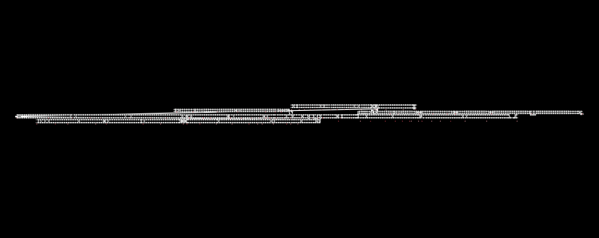
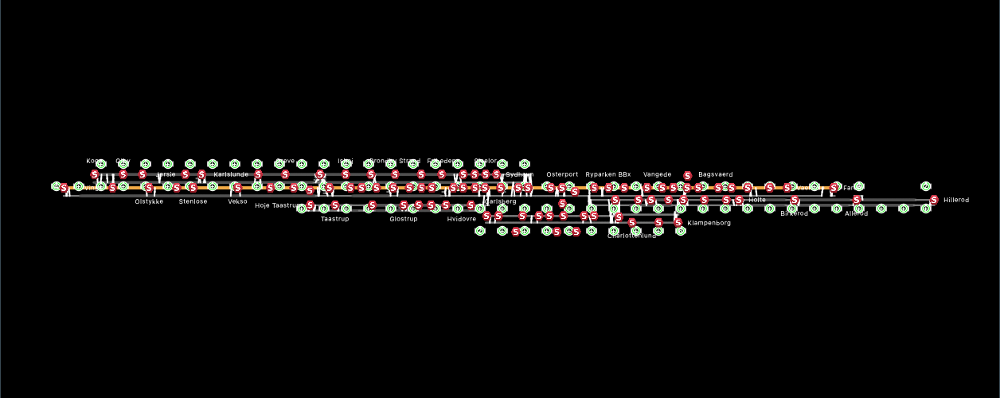

# Historical track presentation

The visual reference is the initial imported renderer `472d0b5`, particularly
`paintNode`, `paintStationNode`, `paintStationIcon`, `paintStationName`,
`arcDrawing`, `paintConnection`, `paintSignal` and `paintTrain`. The later
`f138134` manifest repair does not change these symbols. The renderer style map
records the primitive-by-primitive restoration.

The earlier Copenhagen comparison images remain useful as records of the
pre-restoration state, not as acceptance captures for this change:

Canonical authored geometry and Fit padding remain in use, so comparisons must
distinguish geometry from symbol presentation. Station artwork uses a
station-building SVG while retaining the historical scene-space anchor and
size. The historical passenger PNG is restored as a separate resource; train
polygon colors use the original `VisualPolish.cpp` palette. The original
renderer did not paint a train category badge or speed label over the locomotive.

## Preview and runtime infrastructure

Normal Open now draws semantic track, connection, ordinary-node and station-node
items before Run, using the same paint classes as prepared runtime. Preview has
canonical string identities and read-only inspectors, not native simulation
objects. White platform bars use the existing passenger-GUI mode; preview does
not invent passenger counters. Inspection does not select an editor row or
modify authored geometry. Rebuild, replacement and Run clear preview inspection
and close menus; delayed menu actions re-resolve identities with revision and
mode guards.

For runnable directed chains, preview mirrors the current runtime node rule:
the first point is ordinary even if a station belongs there; ordinary start
points on a four-node track have zero painted size, while station overrides at
later points and the final endpoint remain visible. Invisible ordinary nodes
retain picking targets. Four nodes alone do not establish a Copenhagen double
switch. All authored segments remain; historical case-specific arc and endpoint
omissions are not restored. Malformed fallback chains have safe authoring
preview coverage, not a prepared-runtime equivalence claim.

Station artwork retains its own canonical identity, including duplicate names
and position-only stations. Platform membership follows authored-order native
field assignments; a later position-only membership replaces the station but
retains any prior platform. Position-only artwork searches visible cached lines
in authored order. Positions outside every visible line remain unsupported for
comparison. Artwork and name visibility do not hide structural station squares.

Offscreen semantic, identity, lifetime and prepared-runtime checks are not
calibrated visual acceptance. Matched-extent historical captures for Paimpol,
Netherlands, Copenhagen and Assignment, plus complete manual interaction
coverage, remain required. This infrastructure fix does not close that acceptance work.
